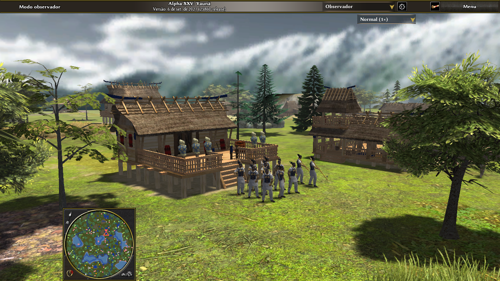

# Ancient Civ Japanese Wakoku (Yayoi period)- 0 A.D. Civilization Mod

Japanese civilization time period is  300 B.C. to 100 A.D.

> This mod is co-developed for the open source game 0 A.D: Empires Ascendant.

### Adjustments and improvements

The project is still in development and the next updates will focus on the following tasks:

- [x] Improving 3D Models.
- [ ] New textures for units.

## Download

You can clone the github project to test this mod.

There is only one download option for every version, because the same mod can work across all platforms 0 A.D. can run on. This means you only need one ZIP file regardless if you are using Windows, Linux or macOS.

## Installation

See https://trac.wildfiregames.com/wiki/Modding_Guide#Howtoinstallmods

## Contributing

We could always use another helping hand with this project. There are several ways to help and contribute to the Yayoi mod:

- Download, install and play the mod.
- Promote the mod by telling friends about it, create game play videos or write a blog article about it.
- Report problems and bugs.
- Help to translate the mod in different languages.
- Be a community manager and help others.
- Create maps.
- Write news article for new releases and changes.
- Create 2D or 3D art.
- Help with research for units and buildings.
- Contribute sound.
- Help with the development.
- Test new releases and report your findings.

## 🤝 Contributors

* Carltonus: translation and historical research,
* Lion.Kansen: 2D art,
* Stan`: 2D/3D art,
* Welton Lopes (Lopess): Code and 2D/3D art,
* RadioTraining: 2D art.

 And all members that contributed to the forum thread [here](https://wildfiregames.com/forum/topic/20122-japan-in-the-period-of-0-ad/).
